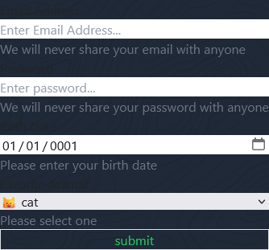

# Customization

While being effortless to use, QuickForm provides support for a wide variety of customization.

There are a few ways to customize QuickForm:

- **[Using attributes](../attributes)**: You can use the `attributes` to decorate the individual fields and their looks.
- **[Customizing the whole layout](#custom-layout)**: You can create your own custom proxy component and use the `QuickForm` component
  inside it.

---

## Custom layout

This is a step-by-step guide to creating a custom layout for your app.
Please note, that this process may seem a little complex for users who are not familiar with Blazor.

---


## Define the directives

``` jsx title="AppForm.razor - declaring directives" linenums="1" 
@using QuickForm.Components // (1)!
@inherits QuickForm<TEntity> // (2)!
@typeparam TEntity where TEntity : class, new()  // (3)!
```

1. The `@using` directive is used to import the namespace of the `QuickForm` component.
   This is necessary to use the `QuickForm` component in the current file.
2. The `@inherits` directive is used to specify the base class for the component. This is the class that contains the logic for the
   component.
   In this case, we are inheriting from the `QuickForm` component, which is the base class for the QuickForm component.
3. The `@typeparam` directive is used to specify that the component will be generic and work with any type,
   as long as it satisfies the constraints specified in the `where` clause.

---


## Create the layouts

``` jsx title="AppForm.razor - setting parameters and field layouts" linenums="5" hl_lines="3-4 8-24 28-30"
@{
    // Additional attributes, in this case, it is the class to be applied to the form.
    AdditionalAttributes ??= new Dictionary<string, object>();
    AdditionalAttributes.Add("class", "flex flex-col");

    // Field layout
    ChildContent = context => // (1)!
        @<div class="flex flex-col">
            <label for="@context.EditorId"> // (2)!
                @context.DisplayName // (3)!
            </label>

            @context.InputComponent("peer") // (4)!

            <span class="text-gray-500">
                @context.Description // (5)!
            </span>

             <span class="hidden peer-[.valid]:block text-green-700">
                 @context.ValidFeedback // (6)!
             </span>
            
            @context.ValidationMessages("hidden peer-[.invalid]:block text-red-700") // (7)!
        </div>;
 
    // Submit button layout
    SubmitButtonTemplate =
        @<button type="submit" class="border border-green-500 text-green-500">
            submit
        </button>;
}
```

1. The markup inside the `ChildContent` fragment, will be applied to individual fields.
   The `@context` object is used to access the field's metadata and the input component. It is an object which
   implements [IQuickFormField](../api/QuickForm.Components.IQuickFormField).
2. `@context.EditorId` is a string, which holds the id of the input field. This can be used to associate the label with the input field.
   It is automatically generated
3. `@context.DisplayName` is a string, which holds the display name for the field. This can be set using the `[DisplayName]` attribute.
4. `@context.InputComponent` is a [RenderFragment&lt;string&gt;](https://blazor-university.com/templating-components-with-renderfragements/)
   that renders the input field. The string parameter for this RenderFragment is the CSS class to be applied to the input field.
5. `@context.Description` is a string, which holds the description for the field. This can be set using the `[Description]` attribute.
6. `@context.ValidFeedback` is a string, which holds the valid feedback for the field. This can be set using the `[ValidFeedback]` attribute.
7. Just like the `@context.InputComponent`, `@context.ValidationMessages` is also
   a [RenderFragment&lt;string&gt;](https://blazor-university.com/templating-components-with-renderfragements/)
   that renders the validation messages. The string parameter for this RenderFragment is the CSS class to be applied to the container
   element containing validation messages.

!!! info "@context"

    See [IQuickFormField]() interface for more information on the `@context` object and what fields are abstracted to you.

---

## **Important!** add the base component's markup

``` jsx title="AppForm.razor - parent markup rendering" linenums="37" hl_lines="2"
@{
    base.BuildRenderTree(__builder); // (1)!
}
```

1. This line is used to call your custom component's base class's - QuickForm's `BuildRenderTree` method.

!!! warning "Important"

    This is necessary to render the form and its fields. **Without this line your custom form will not be rendered.**

---


## Congratulations!

You can now use your component all around your application!

Here is what a minimally styled TailwindCSS form looks like:


