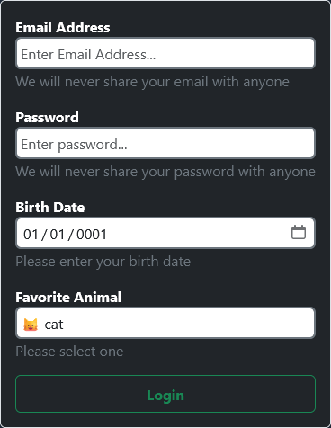
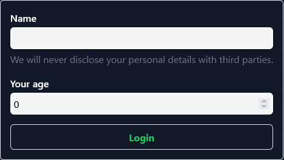

---
title: Getting started
---

# Getting started

## Add the package

You can use the `dotnet add` command to install QuickForm to your project.

```bash
dotnet add package QuickForm
```

---

## Import the namespace

In your `_Imports.razor` file, or your component file, import the QuickForm library with `@using QuickForm.Components`

```csharp title="_Imports.razor"
@using QuickForm.Components
```

---

## Choose your components

QuickForm comes with two default implementations to get you started:

- `TwQuickForm<TEntity>` - A form component that uses TailwindCSS classes for styling
- `BsQuickForm<TEntity>` - A form component that uses Bootstrap classes for styling

!!! info "Customization"

    if you wish to customize the form to suit your own needs, see [Customization](../customization)

??? example "Preview of the components"

    This is what the components could look like, depending on the one you choose.
    The tailwind version has dark mode support along hover effects.

    Keep in mind you can always [customize](../customization) the components to tailor your specific needs.
    
    === "Tailwind"

        { loading=lazy }

    === "Bootstrap"
    
        { loading=lazy }

---

## Create your model

```csharp
public class Person
{
    public string Name { get; set; }
    public int Age { get; set; }
}
```

---

## Decorate your model

!!! info "This is optional"

Here are some of the most common and basic attributes you can use to customize and flavor the generated form

- `[Required]` - Marks a property as required
- `[DisplayName]` - Changes the display name of a property
- `[Description]` - Adds a description to the input
- `[Placeholder]` - Adds a placeholder to the input
- `[Range]` - Adds a range validation to the input

```csharp
public class Person
{
    [Required]
    [Description("We will never disclose your personal details with third parties.")]
    public string Name { get; set; }
    
    [Required]
    [DisplayName("Your age")]
    [Range(18, 100)]
    public int Age { get; set; }
}
```

!!! info "Attributes"

    For a list of all available attributes, see [Attributes](../attributes)

---

# Create the form

=== "Tailwind"

    ``` jsx
    <TwQuickForm Model="@Person" OnValidSubmit="@HandleValidSubmit" />
    ```
    ```csharp
    @code 
    {
        private Person Person = new Person();

        private void HandleValidSubmit()
        {
            // Do something with the form data
        }
    }
    ```

=== "Bootstrap"

    ``` jsx
    <BsQuickForm Model="@Person" OnValidSubmit="@HandleValidSubmit" />
    ```
    ```csharp
    @code 
    {
        private Person Person = new Person();

        private void HandleValidSubmit()
        {
            // Do something with the form data
        }
    }
    ```

---


# Congratulations!

You now have a fully functional form with validation and submit handling.

=== "Tailwind"

    { loading=lazy }

=== "Bootstrap"

    { loading=lazy }


---

# Next steps

<div class="grid cards" markdown>

- :material-format-font: [Create a __custom__ form](../customization)
- :material-format-font: [Check out the attributes](../attributes)

</div>